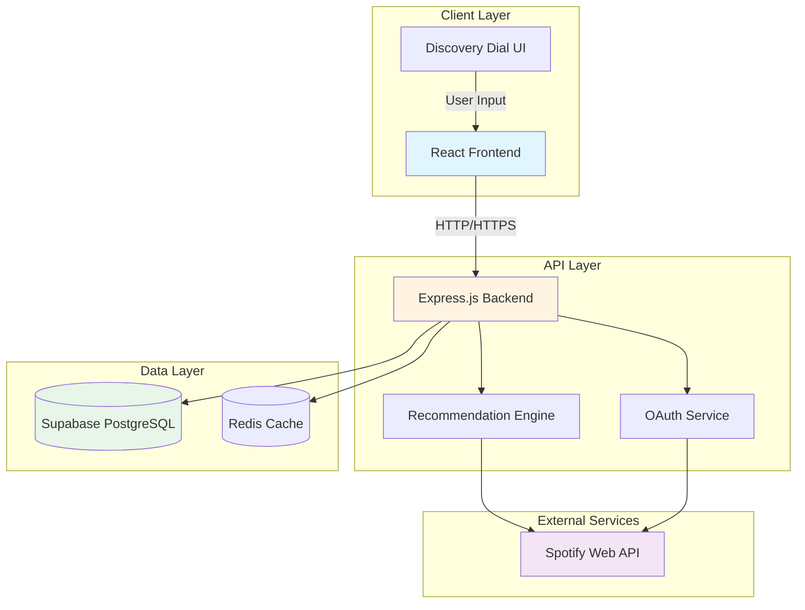
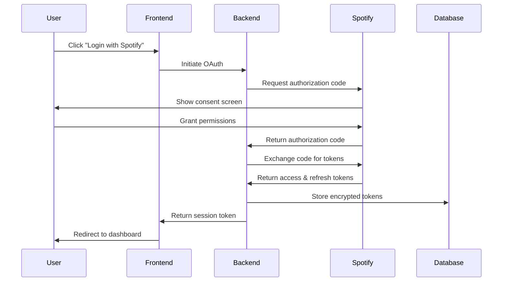
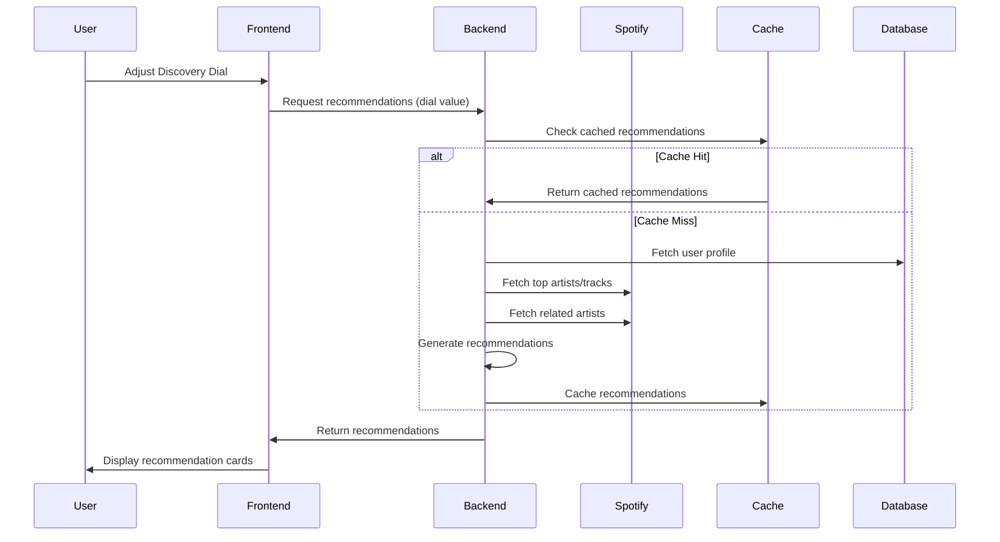
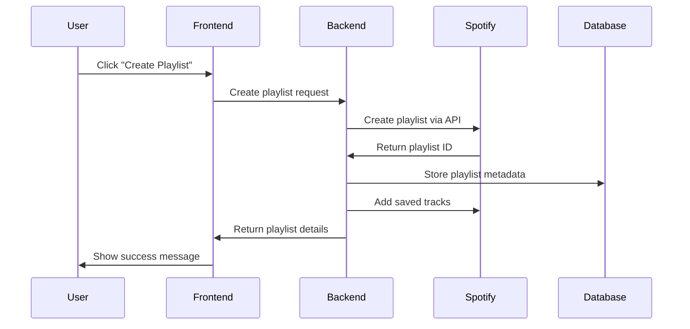

# Spotify Discovery Dial - System Architecture

## Table of Contents
1. [System Overview](#system-overview)
2. [Architecture Diagram](#architecture-diagram)
3. [Component Architecture](#component-architecture)
4. [Data Flow](#data-flow)
5. [API Design](#api-design)
6. [Database Schema](#database-schema)
7. [Security Architecture](#security-architecture)
8. [Deployment Architecture](#deployment-architecture)
9. [Technology Stack](#technology-stack)

---

## System Overview

The Spotify Discovery Dial is a full-stack web application consisting of:
- **Frontend:** React/TypeScript SPA with interactive Discovery Dial UI
- **Backend:** Express.js API server with Spotify integration
- **Database:** Supabase PostgreSQL for user data and analytics
- **External Services:** Spotify Web API for music data and recommendations

### Key Principles
- **Separation of Concerns:** Clear boundaries between frontend, backend, and data layers
- **Scalability:** Horizontal scaling capability for backend services
- **Security:** OAuth 2.0, encrypted tokens, secure API communication
- **Performance:** Caching strategies, rate limiting, optimized data fetching
- **Observability:** Comprehensive logging, monitoring, and analytics

---

## Architecture Diagram



---

## Component Architecture

### Frontend Components

#### Core Components
```
src/
├── components/
│   ├── auth/
│   │   ├── LoginForm.tsx
│   │   ├── OAuthCallback.tsx
│   │   └── UserProfile.tsx
│   ├── discovery/
│   │   ├── DiscoveryDial.tsx
│   │   ├── RecommendationCard.tsx
│   │   ├── RecommendationList.tsx
│   │   └── DiscoveryScore.tsx
│   ├── playlist/
│   │   ├── PlaylistManager.tsx
│   │   ├── PlaylistCard.tsx
│   │   └── PlaylistCreator.tsx
│   └── common/
│       ├── LoadingSpinner.tsx
│       ├── ErrorMessage.tsx
│       └── EmptyState.tsx
├── hooks/
│   ├── useSpotifyAuth.ts
│   ├── useRecommendations.ts
│   ├── useUserProfile.ts
│   └── useAnalytics.ts
├── services/
│   ├── api.ts
│   ├── spotifyApi.ts
│   └── analytics.ts
├── context/
│   ├── AuthContext.tsx
│   └── RecommendationContext.tsx
└── utils/
    ├── recommendationScoring.ts
    └── formatters.ts
```

#### Component Responsibilities

**Authentication Components:**
- `LoginForm`: Spotify OAuth login button and flow
- `OAuthCallback`: Handle OAuth callback and token exchange
- `UserProfile`: Display user info and listening stats

**Discovery Components:**
- `DiscoveryDial`: Interactive 0-100 slider with visual feedback
- `RecommendationCard`: Individual recommendation with actions
- `RecommendationList`: Grid/list of recommendations
- `DiscoveryScore`: Visual representation of novelty score

**Playlist Components:**
- `PlaylistManager`: Interface for managing discovery playlists
- `PlaylistCard`: Display playlist info and actions
- `PlaylistCreator`: Form for creating new playlists

### Backend Components

#### Server Structure
```
src/
├── server.ts
├── app.ts
├── config/
│   ├── database.ts
│   ├── spotify.ts
│   └── environment.ts
├── routes/
│   ├── auth.ts
│   ├── recommendations.ts
│   ├── playlists.ts
│   ├── analytics.ts
│   └── health.ts
├── services/
│   ├── spotifyService.ts
│   ├── recommendationService.ts
│   ├── playlistService.ts
│   └── analyticsService.ts
├── middleware/
│   ├── auth.ts
│   ├── rateLimit.ts
│   ├── errorHandler.ts
│   └── validation.ts
├── models/
│   ├── User.ts
│   ├── Recommendation.ts
│   ├── Playlist.ts
│   └── Analytics.ts
└── utils/
    ├── tokenManager.ts
    ├── cache.ts
    └── logger.ts
```

#### Service Responsibilities

**Spotify Service:**
- OAuth token management and refresh
- API request handling with rate limiting
- Data fetching (artists, tracks, playlists)
- Error handling and retry logic

**Recommendation Service:**
- Artist graph construction
- Genre mapping and analysis
- Scoring algorithm implementation
- Explanation generation

**Playlist Service:**
- Spotify playlist creation/management
- Track addition/removal
- Playlist synchronization

**Analytics Service:**
- Event tracking and storage
- Metric calculation
- Dashboard data aggregation

---

## Data Flow

### Authentication Flow


### Recommendation Generation Flow


### Playlist Creation Flow


---

## API Design

### Authentication Endpoints

#### POST /api/auth/login
Initiate Spotify OAuth flow
```json
Request: {}
Response: {
  "authUrl": "https://accounts.spotify.com/authorize?..."
}
```

#### GET /api/auth/callback
Handle OAuth callback
```json
Request: {
  "code": "authorization_code",
  "state": "state_string"
}
Response: {
  "accessToken": "jwt_token",
  "user": {
    "id": "user_id",
    "displayName": "User Name",
    "email": "user@example.com"
  }
}
```

#### POST /api/auth/refresh
Refresh Spotify access token
```json
Request: {
  "refreshToken": "encrypted_refresh_token"
}
Response: {
  "accessToken": "new_spotify_token",
  "expiresIn": 3600
}
```

#### POST /api/auth/logout
Logout user and revoke tokens
```json
Request: {
  "accessToken": "jwt_token"
}
Response: {
  "success": true
}
```

### User Data Endpoints

#### GET /api/user/profile
Get user's Spotify profile and listening data
```json
Response: {
  "profile": {
    "id": "spotify_user_id",
    "displayName": "User Name",
    "images": ["url_to_image"]
  },
  "topArtists": [
    {
      "id": "artist_id",
      "name": "Artist Name",
      "genres": ["pop", "indie"],
      "popularity": 85
    }
  ],
  "topTracks": [
    {
      "id": "track_id",
      "name": "Track Name",
      "artists": ["Artist Name"],
      "album": "Album Name"
    }
  ],
  "recentlyPlayed": [...]
}
```

### Recommendation Endpoints

#### GET /api/recommendations
Get personalized recommendations
```json
Request: {
  "dialValue": 50,
  "limit": 20,
  "offset": 0
}
Response: {
  "recommendations": [
    {
      "track": {
        "id": "track_id",
        "name": "Track Name",
        "artists": ["Artist Name"],
        "album": {
          "name": "Album Name",
          "images": ["url_to_image"]
        }
      },
      "discoveryScore": 72,
      "confidenceScore": 85,
      "genres": ["indie", "folk"],
      "explanation": "Recommended because: You frequently listen to...",
      "reasons": ["Similar to your top artists", "Genre exploration"]
    }
  ],
  "meta": {
    "dialValue": 50,
    "total": 100,
    "cached": false
  }
}
```

#### POST /api/recommendations/feedback
Submit feedback on recommendations
```json
Request: {
  "trackId": "track_id",
  "action": "like" | "dislike" | "save",
  "dialValue": 50
}
Response: {
  "success": true,
  "updatedProfile": true
}
```

### Playlist Endpoints

#### POST /api/playlists
Create a new discovery playlist
```json
Request: {
  "name": "Discovery Dial - Balanced",
  "description": "My balanced discovery recommendations",
  "dialValue": 50,
  "isPublic": false
}
Response: {
  "playlist": {
    "id": "playlist_id",
    "name": "Discovery Dial - Balanced",
    "url": "https://open.spotify.com/playlist/...",
    "trackCount": 0
  }
}
```

#### POST /api/playlists/:playlistId/tracks
Add tracks to playlist
```json
Request: {
  "trackIds": ["track_id_1", "track_id_2"]
}
Response: {
  "success": true,
  "addedCount": 2
}
```

#### GET /api/playlists
Get user's discovery playlists
```json
Response: {
  "playlists": [
    {
      "id": "playlist_id",
      "name": "Discovery Dial - Comfort",
      "dialValue": 20,
      "trackCount": 15,
      "url": "https://open.spotify.com/playlist/...",
      "updatedAt": "2024-01-15T10:30:00Z"
    }
  ]
}
```

### Analytics Endpoints

#### POST /api/analytics/events
Track analytics events
```json
Request: {
  "eventType": "recommendation_generated",
  "properties": {
    "dialValue": 50,
    "count": 20,
    "sessionDuration": 120
  }
}
Response: {
  "success": true
}
```

#### GET /api/analytics/dashboard
Get analytics dashboard data (admin only)
```json
Response: {
  "overview": {
    "totalUsers": 1000,
    "activeUsers": 250,
    "totalRecommendations": 50000,
    "avgSessionDuration": 180
  },
  "discoveryMetrics": {
    "newArtistsExposed": 15000,
    "newArtistsSaved": 8000,
    "genreExploration": 120
  },
  "engagementMetrics": {
    "dialUsage": {
      "comfort": 30,
      "balanced": 45,
      "explorer": 25
    },
    "acceptanceRate": 0.65
  }
}
```

### Health Check

#### GET /api/health
Health check endpoint
```json
Response: {
  "status": "healthy",
  "timestamp": "2024-01-15T10:30:00Z",
  "services": {
    "database": "healthy",
    "spotify": "healthy",
    "cache": "healthy"
  }
}
```

---

## Database Schema

### Users Table
```sql
CREATE TABLE users (
  id UUID PRIMARY KEY DEFAULT gen_random_uuid(),
  spotify_id VARCHAR(50) UNIQUE NOT NULL,
  display_name VARCHAR(100),
  email VARCHAR(255),
  profile_image_url TEXT,
  country VARCHAR(2),
  created_at TIMESTAMP DEFAULT CURRENT_TIMESTAMP,
  updated_at TIMESTAMP DEFAULT CURRENT_TIMESTAMP
);

CREATE INDEX idx_users_spotify_id ON users(spotify_id);
```

### User Tokens Table
```sql
CREATE TABLE user_tokens (
  id UUID PRIMARY KEY DEFAULT gen_random_uuid(),
  user_id UUID REFERENCES users(id) ON DELETE CASCADE,
  access_token_encrypted TEXT NOT NULL,
  refresh_token_encrypted TEXT NOT NULL,
  token_expires_at TIMESTAMP NOT NULL,
  scope TEXT NOT NULL,
  created_at TIMESTAMP DEFAULT CURRENT_TIMESTAMP,
  updated_at TIMESTAMP DEFAULT CURRENT_TIMESTAMP
);

CREATE INDEX idx_user_tokens_user_id ON user_tokens(user_id);
```

### User Preferences Table
```sql
CREATE TABLE user_preferences (
  id UUID PRIMARY KEY DEFAULT gen_random_uuid(),
  user_id UUID REFERENCES users(id) ON DELETE CASCADE UNIQUE,
  default_dial_value INTEGER DEFAULT 50 CHECK (default_dial_value BETWEEN 0 AND 100),
  favorite_genres TEXT[],
  blocked_artists TEXT[],
  created_at TIMESTAMP DEFAULT CURRENT_TIMESTAMP,
  updated_at TIMESTAMP DEFAULT CURRENT_TIMESTAMP
);
```

### Recommendations Table
```sql
CREATE TABLE recommendations (
  id UUID PRIMARY KEY DEFAULT gen_random_uuid(),
  user_id UUID REFERENCES users(id) ON DELETE CASCADE,
  track_id VARCHAR(50) NOT NULL,
  track_name VARCHAR(255) NOT NULL,
  artist_id VARCHAR(50) NOT NULL,
  artist_name VARCHAR(255) NOT NULL,
  album_id VARCHAR(50),
  album_name VARCHAR(255),
  album_image_url TEXT,
  genres TEXT[] NOT NULL,
  discovery_score INTEGER NOT NULL CHECK (discovery_score BETWEEN 0 AND 100),
  confidence_score INTEGER NOT NULL CHECK (confidence_score BETWEEN 0 AND 100),
  explanation TEXT NOT NULL,
  dial_value INTEGER NOT NULL CHECK (dial_value BETWEEN 0 AND 100),
  created_at TIMESTAMP DEFAULT CURRENT_TIMESTAMP
);

CREATE INDEX idx_recommendations_user_id ON recommendations(user_id);
CREATE INDEX idx_recommendations_track_id ON recommendations(track_id);
CREATE INDEX idx_recommendations_created_at ON recommendations(created_at);
```

### User Feedback Table
```sql
CREATE TABLE user_feedback (
  id UUID PRIMARY KEY DEFAULT gen_random_uuid(),
  user_id UUID REFERENCES users(id) ON DELETE CASCADE,
  recommendation_id UUID REFERENCES recommendations(id) ON DELETE CASCADE,
  track_id VARCHAR(50) NOT NULL,
  action VARCHAR(20) NOT NULL CHECK (action IN ('like', 'dislike', 'save', 'skip')),
  dial_value INTEGER CHECK (dial_value BETWEEN 0 AND 100),
  created_at TIMESTAMP DEFAULT CURRENT_TIMESTAMP
);

CREATE INDEX idx_user_feedback_user_id ON user_feedback(user_id);
CREATE INDEX idx_user_feedback_track_id ON user_feedback(track_id);
```

### Playlists Table
```sql
CREATE TABLE playlists (
  id UUID PRIMARY KEY DEFAULT gen_random_uuid(),
  user_id UUID REFERENCES users(id) ON DELETE CASCADE,
  spotify_playlist_id VARCHAR(50) UNIQUE NOT NULL,
  name VARCHAR(255) NOT NULL,
  description TEXT,
  dial_value INTEGER NOT NULL CHECK (dial_value BETWEEN 0 AND 100),
  is_public BOOLEAN DEFAULT false,
  spotify_url TEXT,
  track_count INTEGER DEFAULT 0,
  created_at TIMESTAMP DEFAULT CURRENT_TIMESTAMP,
  updated_at TIMESTAMP DEFAULT CURRENT_TIMESTAMP
);

CREATE INDEX idx_playlists_user_id ON playlists(user_id);
CREATE INDEX idx_playlists_spotify_id ON playlists(spotify_playlist_id);
```

### Analytics Events Table
```sql
CREATE TABLE analytics_events (
  id UUID PRIMARY KEY DEFAULT gen_random_uuid(),
  user_id UUID REFERENCES users(id) ON DELETE SET NULL,
  event_type VARCHAR(50) NOT NULL,
  properties JSONB,
  session_id VARCHAR(100),
  created_at TIMESTAMP DEFAULT CURRENT_TIMESTAMP
);

CREATE INDEX idx_analytics_events_user_id ON analytics_events(user_id);
CREATE INDEX idx_analytics_events_event_type ON analytics_events(event_type);
CREATE INDEX idx_analytics_events_created_at ON analytics_events(created_at);
```

### User Sessions Table
```sql
CREATE TABLE user_sessions (
  id UUID PRIMARY KEY DEFAULT gen_random_uuid(),
  user_id UUID REFERENCES users(id) ON DELETE CASCADE,
  session_id VARCHAR(100) UNIQUE NOT NULL,
  started_at TIMESTAMP DEFAULT CURRENT_TIMESTAMP,
  ended_at TIMESTAMP,
  dial_adjustments INTEGER DEFAULT 0,
  recommendations_generated INTEGER DEFAULT 0,
  recommendations_saved INTEGER DEFAULT 0
);

CREATE INDEX idx_user_sessions_user_id ON user_sessions(user_id);
CREATE INDEX idx_user_sessions_session_id ON user_sessions(session_id);
```

---

## Security Architecture

### Authentication & Authorization

#### OAuth 2.0 Flow
1. **Authorization Code Flow:** Secure token exchange with Spotify
2. **Token Storage:** Encrypted storage in database
3. **Token Refresh:** Automatic refresh before expiration
4. **JWT Session Tokens:** Short-lived tokens for API authentication

#### Security Measures
- **Token Encryption:** AES-256 encryption for Spotify tokens
- **Secure Headers:** Implementation of security headers (CSP, HSTS, X-Frame-Options)
- **CSRF Protection:** CSRF tokens for state-changing operations
- **Rate Limiting:** API rate limiting to prevent abuse
- **Input Validation:** Strict validation and sanitization of all inputs

### API Security

#### Middleware Stack
```typescript
// Security middleware pipeline
app.use(helmet()); // Security headers
app.use(cors({ origin: process.env.FRONTEND_URL }));
app.use(rateLimit({ windowMs: 15 * 60 * 1000, max: 100 }));
app.use(express.json({ limit: '10mb' }));
app.use(authMiddleware); // JWT verification
app.use(validationMiddleware); // Input validation
```

#### Data Protection
- **Encryption at Rest:** Database encryption for sensitive data
- **Encryption in Transit:** TLS 1.2+ for all communications
- **Data Minimization:** Only collect necessary user data
- **Anonymization:** Analytics data anonymization
- **Right to Deletion:** User data deletion capability

### Spotify API Security

#### Token Management
- **Scope Minimization:** Request only necessary permissions
- **Token Rotation:** Regular token refresh cycles
- **Error Handling:** Graceful handling of token errors
- **Fallback Mechanisms:** Retry logic with exponential backoff

#### Rate Limiting
- **Request Queuing:** Queue requests to respect rate limits
- **Caching:** Cache responses to reduce API calls
- **Monitoring:** Track API usage and limits
- **Alerting:** Alert on approaching limits

---

## Deployment Architecture

### Infrastructure Overview

```mermaid
graph TB
    subgraph "CDN"
        CDN[Vercel Edge Network]
    end
    
    subgraph "Frontend"
        FE[React Application]
    end
    
    subgraph "Backend"
        LB[Load Balancer]
        API1[API Server 1]
        API2[API Server 2]
        API3[API Server N]
    end
    
    subgraph "Database"
        PG[Supabase PostgreSQL]
        REDIS[Redis Cache]
    end
    
    subgraph "Monitoring"
        MON[Monitoring Service]
        LOG[Logging Service]
    end
    
    CDN --> FE
    FE --> LB
    LB --> API1
    LB --> API2
    LB --> API3
    API1 --> PG
    API2 --> PG
    API3 --> PG
    API1 --> REDIS
    API2 --> REDIS
    API3 --> REDIS
    API1 --> MON
    API2 --> MON
    API3 --> MON
    API1 --> LOG
    API2 --> LOG
    API3 --> LOG
```

### Frontend Deployment (Vercel)

**Configuration:**
- **Framework:** Next.js or Create React App
- **Build Process:** Automatic on git push
- **Environment Variables:** Managed via Vercel dashboard
- **CDN:** Global edge network
- **Domain:** Custom domain with SSL

**Deployment Pipeline:**
1. Push to GitHub
2. Vercel webhook triggered
3. Build and optimize assets
4. Deploy to edge network
5. Update DNS

### Backend Deployment (Railway/Render)

**Configuration:**
- **Runtime:** Node.js 18+
- **Instances:** Multiple instances with load balancing
- **Environment Variables:** Encrypted secrets management
- **Health Checks:** Automatic health monitoring
- **Auto-scaling:** Horizontal scaling based on load

**Deployment Pipeline:**
1. Push to GitHub
2. CI/CD pipeline triggered
3. Run tests and linting
4. Build Docker image
5. Deploy to container orchestration
6. Health check validation

### Database Deployment (Supabase)

**Configuration:**
- **Database:** PostgreSQL 15+
- **Connection Pooling:** PgBouncer for connection management
- **Backups:** Daily automated backups
- **Replication:** Read replicas for analytics queries
- **Extensions:** pg_stat_statements for monitoring

**Migration Strategy:**
- Version-controlled migrations
- Automatic migration on deployment
- Rollback capability
- Data backup before migrations

### Monitoring & Logging

**Application Monitoring:**
- **APM:** Application Performance Monitoring
- **Error Tracking:** Sentry or similar
- **Uptime Monitoring:** External uptime checks
- **Performance Metrics:** Response times, throughput

**Logging Strategy:**
- **Structured Logging:** JSON-formatted logs
- **Log Aggregation:** Centralized log management
- **Log Retention:** 30-day retention policy
- **Sensitive Data:** No sensitive data in logs

---

## Technology Stack

### Frontend Stack

| Component | Technology | Version | Purpose |
|-----------|-----------|---------|---------|
| Framework | React | 18+ | UI framework |
| Language | TypeScript | 5+ | Type safety |
| Styling | Tailwind CSS | 3+ | Utility-first CSS |
| Components | shadcn/ui | Latest | Pre-built components |
| State | Zustand/Context | Latest | State management |
| HTTP | Axios | 1+ | API client |
| Build | Vite/Next.js | Latest | Build tool |
| Testing | Jest/React Testing Library | Latest | Unit testing |

### Backend Stack

| Component | Technology | Version | Purpose |
|-----------|-----------|---------|---------|
| Runtime | Node.js | 18+ | JavaScript runtime |
| Framework | Express.js | 4+ | Web framework |
| Language | TypeScript | 5+ | Type safety |
| Auth | Passport.js | Latest | Authentication |
| ORM | Prisma/Drizzle | Latest | Database ORM |
| Validation | Zod/Joi | Latest | Input validation |
| Rate Limiting | express-rate-limit | Latest | API rate limiting |
| Caching | Redis | 7+ | Response caching |
| Testing | Jest/Supertest | Latest | API testing |

### Database Stack

| Component | Technology | Version | Purpose |
|-----------|-----------|---------|---------|
| Database | PostgreSQL | 15+ | Primary database |
| Hosting | Supabase | Latest | Managed PostgreSQL |
| Cache | Redis | 7+ | Caching layer |
| ORM | Prisma/Drizzle | Latest | Database client |
| Migrations | Prisma Migrate | Latest | Schema management |

### DevOps Stack

| Component | Technology | Version | Purpose |
|-----------|-----------|---------|---------|
| Frontend Hosting | Vercel | Latest | Frontend deployment |
| Backend Hosting | Railway/Render | Latest | Backend deployment |
| CI/CD | GitHub Actions | Latest | Automation |
| Monitoring | Sentry/Vercel Analytics | Latest | Error tracking |
| Logging | Logtail/Datadog | Latest | Log management |
| Version Control | Git | Latest | Code management |

### External Services

| Service | Purpose | API Limits |
|---------|---------|------------|
| Spotify Web API | Music data & recommendations | 180 req/30sec |
| Spotify OAuth | User authentication | Standard OAuth limits |

---

## Performance Considerations

### Caching Strategy

**Response Caching:**
- Cache recommendation responses for 5-10 minutes
- Cache user profile data for 1 hour
- Cache Spotify API responses where possible

**CDN Caching:**
- Static assets cached on CDN
- API responses cached where appropriate
- Cache invalidation on data updates

### Database Optimization

**Indexing Strategy:**
- Index frequently queried columns
- Composite indexes for complex queries
- Regular index maintenance

**Query Optimization:**
- Use connection pooling
- Optimize N+1 queries
- Implement pagination
- Use read replicas for analytics

### API Performance

**Rate Limiting:**
- Implement per-user rate limits
- Implement global rate limits
- Queue requests during high load

**Response Optimization:**
- Compress responses (gzip)
- Minimize payload size
- Use pagination for large datasets
- Implement lazy loading

---

## Scalability Plan

### Horizontal Scaling

**Backend Scaling:**
- Stateless API design for easy scaling
- Load balancer for request distribution
- Auto-scaling based on CPU/memory metrics
- Container orchestration for management

**Database Scaling:**
- Read replicas for analytics queries
- Connection pooling for high concurrency
- Database sharding for large datasets
- Caching layer to reduce database load

### Vertical Scaling

**Resource Allocation:**
- Start with minimum viable resources
- Scale up based on metrics
- Monitor resource utilization
- Optimize before scaling

### Traffic Handling

**Load Patterns:**
- Handle peak traffic during evenings
- Implement request queuing
- Graceful degradation under load
- Circuit breakers for external services

---

## Disaster Recovery

### Backup Strategy

**Database Backups:**
- Daily automated backups
- Point-in-time recovery
- Backup validation
- Off-site backup storage

**Code Backups:**
- Git version control
- Multiple environment deployments
- Disaster recovery runbooks

### Failover Strategy

**High Availability:**
- Multi-region deployment
- Database failover
- Load balancer failover
- DNS failover

**Recovery Time Objective (RTO):** 4 hours
**Recovery Point Objective (RPO):** 1 hour

---

## Monitoring & Alerting

### Key Metrics

**Application Metrics:**
- Request rate and response time
- Error rate and error types
- CPU and memory usage
- Database query performance

**Business Metrics:**
- User registration rate
- Recommendation generation rate
- User engagement metrics
- Feature adoption rates

### Alerting

**Critical Alerts:**
- API downtime (>5 minutes)
- Database connection failures
- Error rate >5%
- Security incidents

**Warning Alerts:**
- High response times (>2s)
- Approaching rate limits
- High memory usage (>80%)
- Unusual traffic patterns

---

## Development Workflow

### Git Workflow

**Branch Strategy:**
- `main` - Production code
- `develop` - Integration branch
- `feature/*` - Feature branches
- `bugfix/*` - Bug fix branches
- `hotfix/*` - Production hotfixes

**Commit Convention:**
```
feat: add discovery dial component
fix: resolve token refresh issue
docs: update API documentation
test: add recommendation engine tests
refactor: optimize database queries
```

### Code Review

**Review Process:**
- Pull request required for all changes
- At least one approval required
- Automated tests must pass
- Code quality checks must pass

### Testing Strategy

**Frontend Testing:**
- Unit tests for components
- Integration tests for flows
- E2E tests for critical paths

**Backend Testing:**
- Unit tests for services
- Integration tests for API
- Load tests for performance

---

## Future Architecture Considerations

### Potential Enhancements

**Microservices:**
- Split recommendation engine into separate service
- Separate analytics service
- Event-driven architecture

**Advanced Features:**
- Real-time WebSocket connections
- Machine learning pipeline
- Advanced caching strategies
- GraphQL API

**Infrastructure:**
- Kubernetes orchestration
- Service mesh for inter-service communication
- Advanced monitoring and observability
- Multi-region deployment